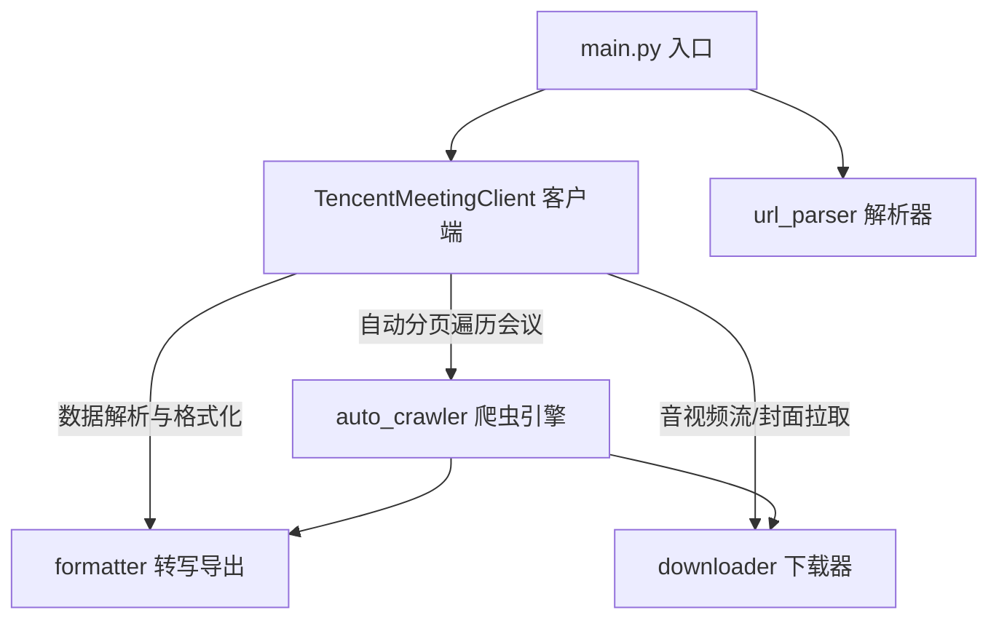

# 腾讯会议全自动全量备份工具 (`wemeet-backup`)

Python 自动化工具，用于一键遍历并批量下载腾讯会议网页版（[meeting.tencent.com](https://meeting.tencent.com)）个人账号下**所有历史会议**的**云录制音视频文件 (.mp4/.m4a)** 与 **会议转写逐字稿（Minutes / Transcription）**。

---

## 🌟 核心特性

- 🤖 **账号全量自动遍历**：无需手动收集会议链接，自动通过 API 分页拉取您账号下记录的所有历史会议列表。
- 🔗 **多类型场景兼容**：完美支持单会议录制、合集记录、以及包含多段视频的“中间记录页面”（`shared-record-middle`）自动递归展开。
- 📝 **多格式逐字稿导出**：转写纪要自动导出为 **Markdown (`.md`)**、**纯文本 (`.txt`)**、**SRT 字幕 (`.srt`)** 及 **原始 JSON (`.json`)** 等格式。
- 🎬 **音视频及封面自动拉取**：自动提取高清晰度云录像视频（.mp4）、音频流及会议封面缩略图。
- ⚡ **智能重用与断点跳过**：已完成备份的音视频与转写文件自动识别校验，防止重复下载浪费带宽。
- 📊 **实时下载进度条**：基于 `tqdm` 提供多线程/分块下载进度展示，包含实时下载速度与百分比。
- ⚙️ **灵活配置与 CLI 命令**：既可通过 `config.json` 简易配置，也可通过丰富的命令行参数精准控制。

---

## 🏗️ 系统架构与模块划分



有关各个模块的具体接口设计与 API 实现细节，请参阅 [架构与接口设计文档](file:///Users/apple/Repo/dev/backup-tencent-meetings/docs/architecture.md)。

---

## 🚀 快速开始

### 1. 安装依赖环境

确保本地已安装 Python 3.8+ 环境，克隆项目后运行：

```bash
pip install -r requirements.txt
```

### 2. 获取并配置 Cookie (`config.json`)

1. 复制配置文件模板：
   ```bash
   cp config.example.json config.json
   ```
2. 用浏览器打开并登录 [腾讯会议网页版个人中心](https://meeting.tencent.com/user-center/meeting-record)。
3. 按 `F12` 开启开发者工具（Developer Tools），切换到 **Network (网络)** 标签页。
4. 刷新页面，点击任意一个 `meeting.tencent.com` 的网络请求。
5. 在请求头 (Request Headers) 中找到 `Cookie`，复制其完整的字符串值。
6. 粘贴至 `config.json` 中的 `"cookie"` 属性：
   ```json
   {
     "cookie": "web_uid=xxxx; account_corp_id=xxxx; we_meet_token=xxxx; ...",
     "output_dir": "./downloads",
     "download_video": true,
     "export_transcript": true,
     "transcript_formats": ["md", "txt", "json", "srt"]
   }
   ```

### 3. 执行一键全量备份

直接运行主脚本：

```bash
python main.py
```

脚本将自动对接 API，遍历您账号下的全部历史会议，并将结果有序保存到 `./downloads/` 目录中。

---

## 📁 备份保存结构示例

备份文件将自动以 `会议主题_记录ID` 建立独立文件夹分类存放：

```text
downloads/
├── 选修课总结复盘_b4d20ddb-9464-41e2-a613-e3259c67baa6/
│   ├── cover_b4d20ddb-9464-41e2-a613-e3259c67baa6.png        # 录像封面
│   ├── video_b4d20ddb-9464-41e2-a613-e3259c67baa6.mp4        # 云录制视频
│   ├── transcript_b4d20ddb-9464-41e2-a613-e3259c67baa6.md    # Markdown 转写
│   ├── transcript_b4d20ddb-9464-41e2-a613-e3259c67baa6.txt    # 纯文本转写
│   ├── transcript_b4d20ddb-9464-41e2-a613-e3259c67baa6.srt    # SRT 播放字幕
│   └── transcript_b4d20ddb-9464-41e2-a613-e3259c67baa6.json   # 原始 API 数据
```

---

## 💡 高级用法与 CLI 参数

可以通过命令行参数直接覆盖配置文件的设置：

| 命令行参数 | 简写 | 默认值 | 说明 |
| :--- | :--- | :--- | :--- |
| `--config` | `-c` | `config.json` | 指定配置文件路径 |
| `--output` | `-o` | `./downloads` | 自定义下载输出根目录 |
| `--cookie` | | 无 | 在命令行直接指定 Cookie 字符串 |
| `--meeting-id` | | 无 | 仅备份指定的单个 Meeting ID |
| `--recording-id` | | 无 | 仅备份指定的单个 Recording ID |
| `--share-id` | | 无 | 仅备份指定的 Share ID (分享 Token) |
| `--file` | `-f` | 无 | 从文本文件批量读取链接列表备份 |
| `--formats` | | `md,txt,json,srt` | 指定导出的转写文本格式（逗号分隔） |
| `--no-video` | | `False` | 加上此参数跳过视频 MP4 下载 |
| `--no-transcript` | | `False` | 加上此参数跳过转写逐字稿导出 |

#### 示例 1：仅导出转写逐字稿，不下载视频
```bash
python main.py --no-video
```

#### 示例 2：备份单个特定会议
```bash
python main.py --share-id "sKOvc8uzP0m3wKeqOf4B4" --topic "重要项目周会"
```

---

## ❓ 常见问题 FAQ & 避坑指南

> [!IMPORTANT]
> **Q: 运行提示 `[错误] 未配置有效的 Cookie！` 或获取列表为空？**
> * **原因**：腾讯会议网页端 Cookie 已失效或未复制完整。
> * **解决**：在腾讯会议网页端重新登录后，重新复制包含 `we_meet_token` 与 `account_corp_id` 的完整 Cookie 并更新至 `config.json`。

> [!NOTE]
> **Q: 为什么部分会议显示 `[已跳过] 该记录类型为纯文字转写/语音记录`？**
> * **原因**：腾讯会议区分“云录制”（有视频画面）与“实时转写/语音记录”（仅有文字/音频）。对于后者，腾讯会议服务器本身不提供视频文件，脚本会自动跳过视频下载并成功导出转写文本。

> [!TIP]
> **Q: 重复运行脚本会重新下载已有文件吗？**
> * **原因**：脚本内置了文件校验机制，如果目标文件已存在且文件大小大于 0，会自动提示 `[已跳过]` 并快速继续下一场会议，无需担心重复消耗带宽。

---

## 📚 更多文档

- 🛠️ [系统架构与模块设计文档](file:///Users/apple/Repo/dev/backup-tencent-meetings/docs/architecture.md)
- 📡 [腾讯会议 API 逆向工程参考](file:///Users/apple/Repo/dev/backup-tencent-meetings/docs/api.md)
- 📝 [原始需求与开发背景说明](file:///Users/apple/Repo/dev/backup-tencent-meetings/docs/owner.md)
