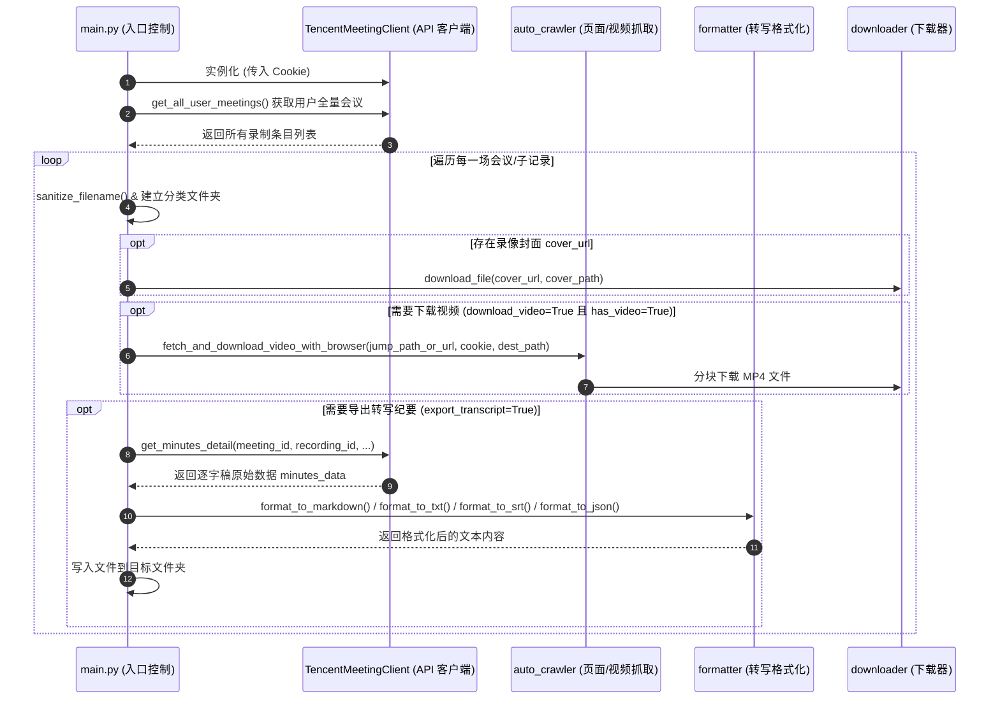

# 架构与模块设计文档

本文档详细说明 `backup-tencent-meetings` 工具的核心架构、数据流向以及各个 Python 模块的具体职责。

---

## 🏛️ 核心架构图

---

## 📦 模块职责分工

| 模块文件 | 类 / 主要函数 | 核心职责 |
| :--- | :--- | :--- |
| [main.py](file:///Users/apple/Repo/dev/backup-tencent-meetings/main.py) | `main()`, `process_single_backup()` | 命令行参数解析、读取 `config.json`、控制整体备份流程、过滤跳过机制 |
| [tencent_meeting/client.py](file:///Users/apple/Repo/dev/backup-tencent-meetings/tencent_meeting/client.py) | `TencentMeetingClient` | 封装腾讯会议 RESTful API 请求，处理分页逻辑、请求头伪造及基础鉴权 |
| [tencent_meeting/auto_crawler.py](file:///Users/apple/Repo/dev/backup-tencent-meetings/tencent_meeting/auto_crawler.py) | `fetch_and_download_video_with_browser()` | 解析流媒体页面地址，拉取真实的视频 MP4 / 音频 M4A 直链并调度下载 |
| [tencent_meeting/downloader.py](file:///Users/apple/Repo/dev/backup-tencent-meetings/tencent_meeting/downloader.py) | `download_file()` | 基于 `requests` 和 `tqdm` 实现文件流式分块下载、展示实时进度条 |
| [tencent_meeting/formatter.py](file:///Users/apple/Repo/dev/backup-tencent-meetings/tencent_meeting/formatter.py) | `format_to_markdown()`, `format_to_srt()` 等 | 将 API 返回的逐字稿时间戳和段落数据转化为 Markdown、SRT、TXT 和 JSON 格式 |
| [tencent_meeting/url_parser.py](file:///Users/apple/Repo/dev/backup-tencent-meetings/tencent_meeting/url_parser.py) | `parse_tencent_meeting_url()` | 解析用户传入的腾讯会议链接或命令行参数，提取 `meeting_id`, `recording_id`, `share_id` |

---

## 🔑 核心数据接口映射表

腾讯会议后端主要涉及以下关键 API Endpoint：

1. **获取账号历史会议列表**：
   - Endpoint: `/wemeet-tapi/v2/meetlog/dashboard/my-record-list`
   - 作用：获取用户主页下的全量会议索引（支持 `page_index` 与 `page_size` 分页）。

2. **获取会议逐字稿 (Minutes) 详情**：
   - Endpoint: `/wemeet-tapi/v2/meetlog/record-detail/get-minutes-detail`
   - 作用：提取带有发言人、相对毫秒时间戳的逐字稿段落列表。

3. **解析合集/中间记录页面**：
   - Endpoint: `/wemeet-tapi/v2/meetlog/record-detail/page-query-record-files`
   - 作用：展开一个分享集合链接下包含的多段子视频记录。

---

## 🛠️ 二次开发与扩展指南

* **新增导出格式**：只需在 `tencent_meeting/formatter.py` 中新增对应的 `format_to_xxx()` 函数，并在 `main.py` 的导出控制逻辑中注册格式扩展名即可。
* **自定义保存路径规则**：可修改 `main.py` 中的 `process_single_backup()` 函数里的 `folder_name` 生成逻辑（例如加入会议开始时间戳或日期前缀）。
